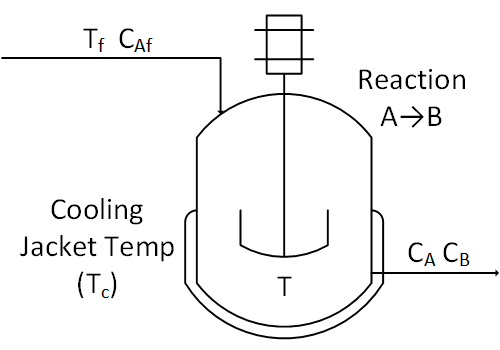

# CSTR_InfluxDB

This project models a continous stirred tank reactor (CSTR), a common type of reactor used in chemical engineering. It is widely used in industrial processes due to its simplicity and ability to handle continuous reactions. It highlights how to leverage InfluxDB, Telegraf, Kafka, faust-streaming, and docker to build a scalable digital twin. 

 

### Inlet Stream (Tf, CAf):
Tf: This represents the temperature of the feed entering the reactor.
CAf: This is the concentration of reactant A in the feed.

### Reaction (A → B):
This indicates the chemical reaction taking place inside the reactor. Reactant A is converted to product B.
Cooling Jacket Temp (Tc or u):

Tc: The temperature of the cooling fluid in the jacket surrounding the reactor. The cooling jacket helps in maintaining the desired temperature inside the reactor by removing excess heat generated by the reaction.

#### Stirrer:

The mechanical stirrer ensures that the contents of the reactor are well-mixed, providing uniform temperature and concentration throughout the reactor.
 
Temperature (T): This is the temperature inside the reactor, which is regulated by the cooling jacket.

### Outlet Stream (CA, CB):
CA: The concentration of reactant A in the outlet stream.
CB: The concentration of product B in the outlet stream.

## Directory Structure 

### without_kafka
This directory contains an example of how to model the CSTR without InfluxDB, kafka, or docker. 

`cstr_model.py` and `pid_control.py` contain the full examples and math modeling a CSTR where the calculations for Ca (concentration of A in the Reactor) and T (Temperature of the Reactor) are decoupled from the caculations of u (cooling jacket temperature) and sp (set point for the reactor) without kafka or docker.  

`cstr_output.txt` contains the output from `cstr_model.py` and `pid_control.py`. 

[without_kafka/cstr_reactor.py](without_kafka/cstr_reactor.py) is the basis for [cstr_kafka_influxdb/cstr_model.py](cstr_kafka_influxdb/cstr_model.py).
[without_kafka/pid_control.py](without_kafka/pid_control.py) is the basis for [cstr_kafka_influxdb/pid_controller.py](cstr_kafka_influxdb/pid_controller.py)

### cstr_kafka_influxdb
This directory contains an example of how to model a CSTR with just kafka. 

### cstr_kafka_influxdb_docker
This directory contians a fully dockerized example with kafka, InfluxDB, Telegraf to produce a scalable digital twin. This aims to illustrate how you could monitor several CSTRs and scale out, assuming each CSTR wrote to a different partition. 

