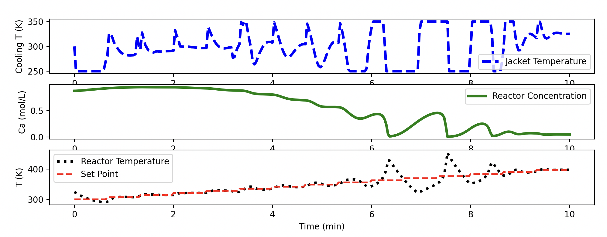

# cstr_forecast 
This directory contains an example of how to use a polynomial regression to predict the next Ca and T values. 

## Run 
1. Create a python env and activate it:
    ```
    pipenv install
    pipenv shell
    ```

2. Run the script:
    ```
    python3 apply_model.py
    ```

3. Deactivate the environment:

    ```
    exit
    ```

## Visualize the output:
You should see the following visualization:
 

As you can see at some point this method leads to a runaway reactor where the cooling jacket is forced to oscillate between it's limits (250 and 350 degrees). However, it fairs pretty well. It also restabilizes. Ideally, retraining could be incorporated if the devaition between the reactor temperature and setpoint increases beyond an acceptible drift to produce better forecasts.  