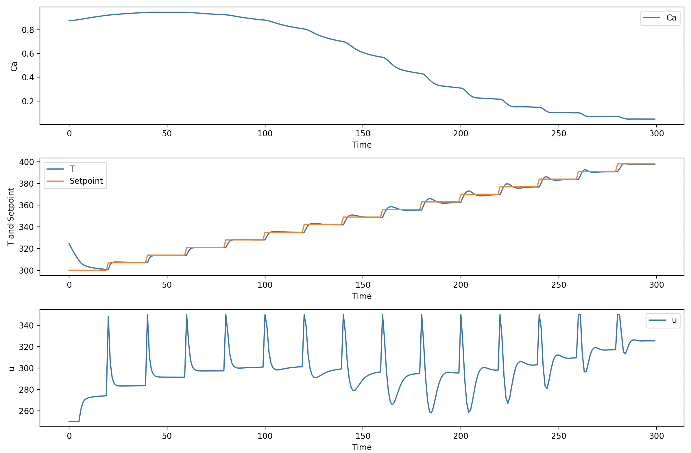

# cstr_kafka 
This directory contains an example of how to model a CSTR with just kafka. 

## Run 
1. Start the docker container. Pull this repo, cd into this directory, and run:
    ```
    docker-compose up -d
    ```

2. Create a python env and activate it:
    ```
    pipenv install
    pipenv shell
    ```
You'll want to create two shells. 

3. Run the apps:
    ```
    faust -A cstr_model  worker -l info
    faust -A pid_controller worker -l info
    ```
Run the cstr-model first. 

4. Stop the container and deactivate the environment:
    ```
    docker-compose down
    ```
    and
    ```
    exit
    ```

### Visualize the output 
To visualize the output you can: 
1. Exec into the kafka container and tail the topic:
    ```
    docker exec -it cstr-influx-kafka-1 /bin/sh
    /opt/kafka/bin/kafka-console-consumer.sh --bootstrap-server localhost:9092 --topic pid_control --from-beginning
    ```
2. Copy the output into a file OR use the existing file [output_pid_cotrol_topic_raw.txt](output_pid_cotrol_topic_raw.txt). 
   
3. Finally run `[visualize_output_from_topic.py](visualize_output_from_topic.py) will output the values in a json and create a visualization of the values. 

 


## Useful Commands
To delete topics:
```
docker exec -it cstr-influx-kafka-1 /bin/sh

/opt/kafka/bin/kafka-topics.sh --delete --topic cstr --bootstrap-server localhost:9092

/opt/kafka/bin/kafka-topics.sh --delete --topic pid_control --bootstrap-server localhost:9092
```

To create topics:
```
/opt/kafka/bin/kafka-topics.sh --create --topic cstr --bootstrap-server localhost:9092 --partitions 1 --replication-factor 1

/opt/kafka/bin/kafka-topics.sh --create --topic pid_control --bootstrap-server localhost:9092 --partitions 1 --replication-factor 1
```

To run apps:
```
faust -A pid_controller worker -l info

faust -A cstr_model  worker -l info
```

Tail the topics:
```
/opt/kafka/bin/kafka-console-consumer.sh --bootstrap-server localhost:9092 --topic cstr --from-beginning

/opt/kafka/bin/kafka-console-consumer.sh --bootstrap-server localhost:9092 --topic pid_control --from-beginning
```

