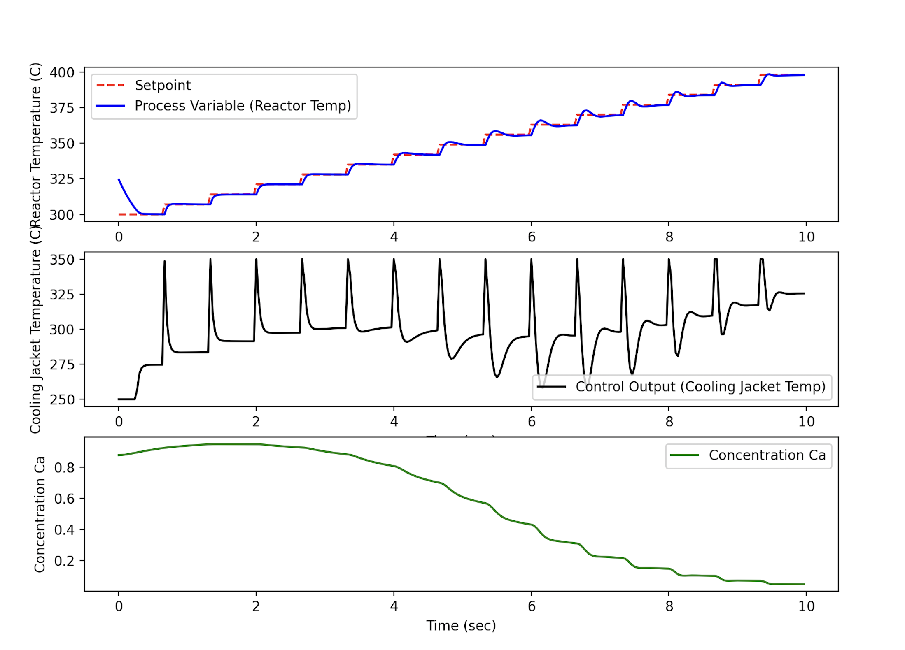

# without_kafka 
This directory contains an example of how to model a CSTR with Python. 

## Run 
1. Create a python env and activate it:
    ```
    pipenv install
    pipenv shell
    ```

2. Run the script:
    ```
    python3 pid_control.py
    ```

3. Deactivate the environment:

    ```
    exit
    ```

## Visualize the output:
You should see the following visualizatiobn:
 